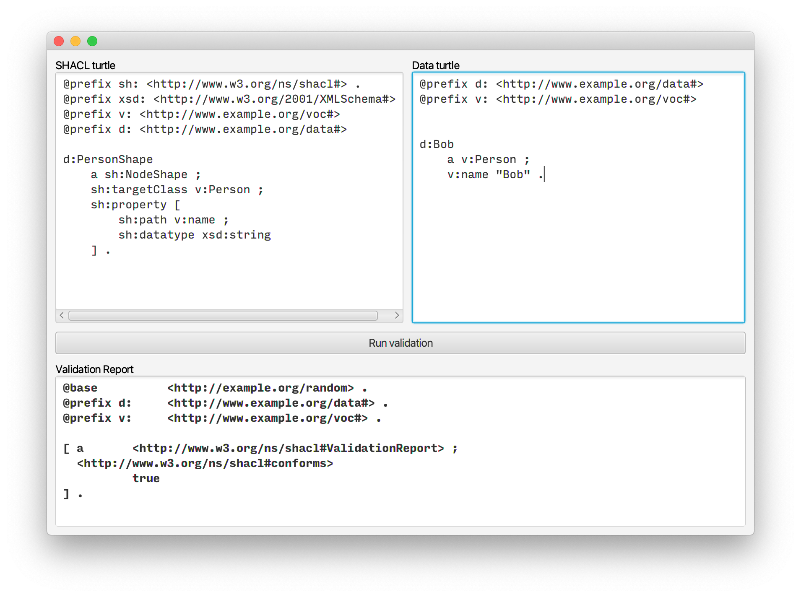

# Bare-bones SHACL-core validation tool
This tool is meant for people who want to try out SHACL-core validation. I made it mainly for myself to have a SHACL validator that behaves as I expect it to.

Usage is straight forward: 
* The top left text field is for writing SHACL-core graphs in the Turtle syntax.
* The top right text field is for writing an RDF graph in Turtle.
* The 'Run TQ validation' button is for validating the input from the text fields using the TopQuadrant SHACL implementation.
* The 'Run Jena validation' button is the same as above for the Apache Jena implementation.
* Validation report are shown in the text field at the bottom of the window.

It looks like this:

## Running the program
As it was not possible to package Apache Jena together with JavaFX (trough jlink) into one jar file,
running the program requires downloading the source and compiling it.

Requirements are that you have installed:
* OpenJDK 14 or similar Java 14 implementation
* Maven software project management tool

To compile and run the program, first clone the project, then:
1. In the folder containing `pom.xml`, run: `$ mvn clean install` to install the dependencies and plugins.
2. Then compile the program with `$ mvn compile`.
3. Run the program with `$ mvn javafx:run`.