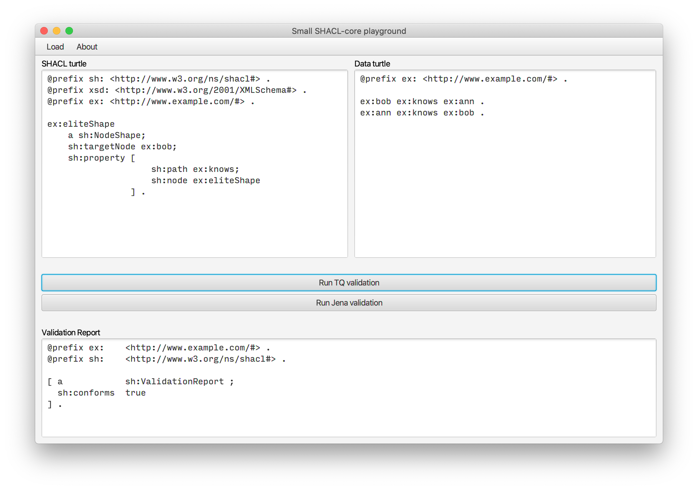

# Bare-bones SHACL-core validation tool
It looks like this:

## Running the program
As it was not possible to package Apache Jena together with JavaFX (trough jlink) into one jar file,
running the program requires downloading the source and compiling it.

Requirements are that you have installed:
* OpenJDK 14 or similar Java 14 implementation
* Maven software project management tool

To compile and run the program, first clone the project, then:
1. In the folder containing `pom.xml`, run: `$ mvn clean install` to install the dependencies and plugins.
2. Then compile the program with `$ mvn compile`.
3. Run the program with `$ mvn javafx:run`.